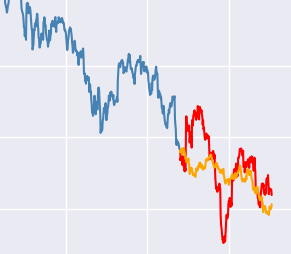

## Presentation Scope:
Here we used some standard techniques for time series data analysis. These techniques can be found in the folder named **'Code'**, and the presentation of results is in the Jupyter file named apresentacao.ipynb.

### 1) EDA of the dataset:
- Analysis of trends and seasonality in the complete dataset
- Application of **Trend and Seasonality** tools

### 2) Fourier at different moments of the IBOV price:
- Application of Fourier in **Trend**
- Application of Fourier in the **Stationary** period
- Investigate trend component in the Frequency domain

### 3) Modeling:
- Application of prediction model in the trend period of raw dataset.
- Application of prediction model in smoothed dataset (SMA 8p)
- Application of prediction model in smoothed dataset (wavelet)
- Compare distance results between prediction and real value across datasets.

The best analysis we had was using the Hot-Winter technique to predict
the rest of the downtrend (TF=M30)

  
 

In this image, in blue you see all data from IBOV between 10/06/2021 until 01/12/2021 TF = 30 min, used to be in train phase.
in red you see the data for test and orange is the prediction used with Hot-Winter technique.
There are other few analysis and predictions with others techniques. Checkout at .ipynb files in 'Atividade' folder.
